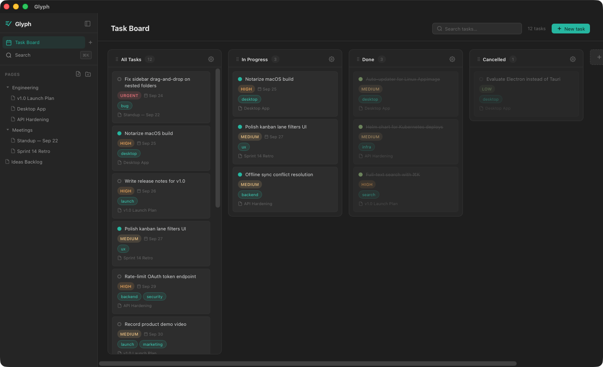

# Glyph

A notes-taking and task-tracking app with a WYSIWYG markdown editor and kanban-style task board.



> **Design philosophy:** Task management should never be separate from the thinking that produces it. Glyph treats your notes as the source of truth — write a bullet under a TODO heading and it becomes a trackable task automatically. No context switching, no copy-pasting into a separate tool. If you can write a bullet list, you can run a project.

- **Rich editor** — TipTap / ProseMirror. Typing `#` becomes a heading, `-` becomes a bullet, etc.
- **TODO detection** — Bullets under a `TODO` heading automatically create linked tasks.
- **Kanban board** — Configurable lanes with filters and sorting (auto, field, or manual).
- **Page tree** — Hierarchical pages and folders, unlimited depth.
- **Search** — Full-text search via `⌘K` modal or dedicated search page (Fuse.js).
- **Two storage backends** — LocalStorage (offline, no setup) or Go REST API + PostgreSQL.
- **Realtime collaboration** — With the API backend, several people can edit a note at once, with live cursors (Yjs + Hocuspocus; see [collab/README.md](collab/README.md)).
- **MCP server** — AI agents (Claude, Cursor, …) can read and write your notes and tasks. See [MCP server](#mcp-server).

## Tech stack

| Layer | Choice |
|---|---|
| Frontend | SvelteKit 2, Svelte 5 (runes), TypeScript |
| Editor | TipTap 3 (`@tiptap/core`, `@tiptap/starter-kit`) |
| Styling | Scoped `<style>` + CSS custom properties |
| Search | Fuse.js 7 |
| Backend | Go (Gin), PostgreSQL 16, OIDC auth |
| Collaboration | Node collab service — Hocuspocus 4, Yjs, `@tiptap/extension-collaboration` |
| Package manager | pnpm |

## Prerequisites

- Node.js 20+
- pnpm 9+
- Docker (for Postgres backend)
- Go 1.22+ (for API backend)

## Getting started

### Local mode (no backend)

```bash
pnpm install
pnpm dev              # http://localhost:5173 (localStorage mode)
```

### Docker Compose

Docker Compose is used for local development only. All services run with live reload by default.

```bash
# localStorage mode — Vite dev server on http://localhost:5173
docker compose up

# Full stack (API + Postgres) — Vite on http://localhost:5173, Go API rebuilt on save via Air
docker compose -f docker-compose.yml -f docker-compose.postgres.yml up
```

In full-stack mode, the app is also available at `https://localhost` (self-signed cert via Nginx). **Migrations run automatically** — the `migrate` service runs once before the API starts and then exits; no manual steps required.

The full stack includes the **collab service** (realtime collaborative editing), rebuilt on save. Open the same note in two browsers (e.g. a normal and a private window) to see it. Run with `COLLAB_ENABLED=false` to get single-writer editing instead.

### Resetting local state

| Backend | How to reset |
|---|---|
| localStorage | Clear browser storage (DevTools → Application → Local Storage → Clear all) |
| Postgres | `docker compose … down -v` then `up` again (drops the volume; migrations re-run on next start) |

## Desktop app

Glyph also ships as a native desktop app for macOS and Linux (`src-tauri/`) — a thin window that connects to your self-hosted Glyph server, with automatic updates.

### Installing on macOS

Download the `.dmg` from the [latest release](https://github.com/imaustink/glyph/releases). The app isn't notarized by Apple (notarization requires a paid Apple Developer account), so the first launch of a browser-downloaded copy is blocked by Gatekeeper with:

> "Glyph" is damaged and can't be opened. You should move it to the Trash.

This is not actual corruption — Gatekeeper shows this message for any unnotarized app that was downloaded through a browser. Clear the quarantine flag once, after installing to `/Applications`:

```bash
xattr -cr /Applications/Glyph.app
```

Then open the app normally. This is a one-time step: **updates applied from inside the app are downloaded directly and are never quarantined**, so future versions install without hitting this warning again.

### Installing on Linux

Download the `.deb` or `.AppImage` from the [latest release](https://github.com/imaustink/glyph/releases).

```bash
# Debian/Ubuntu
sudo apt install ./Glyph_*.deb

# AppImage
chmod +x Glyph_*.AppImage
./Glyph_*.AppImage
```

### First launch

On first launch, Glyph asks for the URL of your self-hosted server. It's remembered after that; change it any time from the app menu (**Glyph → Change Server URL…**).

## MCP server

A self-hosted Glyph (API storage mode) includes a remote [Model Context Protocol](https://modelcontextprotocol.io) server at `/mcp`. AI agents can then search, read and write your notes and tasks. All an agent needs is the URL: it registers itself, sends you to Glyph to approve access, and gets a token.

```bash
# Claude Code
claude mcp add --transport http glyph https://glyph.example.com/mcp
```

In Claude.ai or Claude Desktop, add a custom connector with the same URL. Cursor, VS Code and the [MCP Inspector](https://github.com/modelcontextprotocol/inspector) (`npx @modelcontextprotocol/inspector`) connect the same way.

When an agent connects, Glyph shows a consent screen:
- **Workspaces:** you choose which ones the agent can reach, your **personal workspace** and/or any of your **organizations**. The agent can't see anything outside them.
- **Unverified apps:** an app that registered itself is labelled as unverified, and the screen shows where it will redirect you.
- **Revoking:** review or revoke connected apps at any time under **Settings → Connected apps**.

| Tool | What it does | Needs |
|---|---|---|
| `list_workspaces` | Workspaces this connection can reach | — |
| `search` | Text search across notes and tasks | `page:read` or `task:read` |
| `list_pages`, `get_page` | Browse the page tree; read a note as Markdown with its linked tasks | `page:read` |
| `create_page`, `update_page`, `write_page_content` | Create notes, edit details, append to or replace content as Markdown | `page:write` |
| `list_tasks`, `get_task` | Filter and read tasks, in the board's Smart Sort order | `task:read` |
| `create_task`, `update_task`, `delete_task` | Manage tasks. `create_task` with `page_id` also adds the task as a linked bullet under the note's TODO heading | `task:write` |
| `list_lanes`, `get_lane_tasks` | Read personal or folder board lanes and what's in them | `lane:read` |
| `list_templates`, `create_page_from_template` | Use note templates, filling in `{{date}}`-style tokens | `template:read` (+ `page:write`) |

Agents only see the tools their granted scopes allow.

**How it works:**
- **Endpoints:** the server speaks Streamable HTTP, statelessly: every POST gets a JSON reply, with no SSE and no sessions. The API also serves OAuth 2.1 discovery (`/.well-known/oauth-authorization-server`, `/.well-known/oauth-protected-resource`) and dynamic client registration (`POST /oauth/register`).
- **Permissions:** each tool call runs through the regular `/api/v1` handlers with the agent's own token, so agents get exactly the same permission and scope checks as the REST API.
- **Content:** page content is converted between Glyph's ProseMirror documents and Markdown. Bullets linked to tasks render as `- [ ] text <!-- task:ID -->`, so the links survive a round trip. Bullets an agent writes under a TODO heading become linked tasks, just as they do when you type them in the editor.
- **Edit safety:** writes check the page revision they read, so they never silently overwrite an edit you made in the app at the same time.

**Deploying:** set `FRONTEND_URL` on the API to the public origin users reach Glyph at; the Helm chart does this for you. The discovery documents advertise that origin, and `/mcp`, `/oauth/register` and the two `/.well-known/oauth-*` paths must route to the API. The Helm ingress, nginx config, Vite dev proxy and SvelteKit proxy all handle this already.

## Scripts

```bash
pnpm dev          # start dev server (localStorage mode) at http://localhost:5173
pnpm build        # production build (also catches type errors)
pnpm check        # svelte-check + tsc type checking
pnpm preview      # preview production build
```

## Testing

The Makefile is the single entry point for running tests and linters — it mirrors all CI jobs exactly.

```bash
make ci             # everything: lint + unit tests + both E2E projects
make test           # unit tests + both E2E projects (no lint)
make test-unit      # fast: frontend vitest + Go unit tests only
make test-frontend  # type-check, build, vitest
make test-go        # go vet, build, unit tests
make test-e2e-local # Playwright local-storage project (no backend needed)
make test-e2e-api   # Playwright API project via isolated Docker stack
make test-e2e-k8s   # both Playwright projects on a local Kubernetes cluster
make lint           # all linters (svelte-check + golangci-lint + go vet)
```

Run `make help` for the full reference.

### Go unit tests only

```bash
cd api && go test ./... -short
```

Runs unit tests (handler, model, store, memstore packages). Pass `-short` to skip the integration suite that requires Postgres.

### Playwright E2E — API backend

The `make test-e2e-api` target (and `make ci`) uses an isolated Docker stack to avoid conflicting with a running dev environment:

```bash
docker compose -f docker-compose.test.yml up -d --build --wait
pnpm test:e2e:api
docker compose -f docker-compose.test.yml down -v
```

This starts an ephemeral Postgres (port 5433) and Go API (port 8083) in their own Docker project (`glyph-test`), then tears everything down after the run.

### Playwright E2E — local Kubernetes cluster

`make test-e2e-k8s` runs the same specs against `helm/glyph` on a real cluster, so the chart itself is under test alongside the app — the CNPG database, the migration Job, the SvelteKit proxy, and the images built from `Dockerfile` / `api/Dockerfile`.

The cluster is [ferry](https://github.com/imaustink/ferry), which runs the Kubernetes control plane natively on macOS and each pod in its own VM:

```bash
curl -sfL https://get.ferry.kurpuis.com | FERRY_VERSION=v0.5.0 sh -
brew install buildkit    # `ferry image build` runs the builder; buildctl is the client
make test-e2e-k8s
```

The script builds three images straight into the node's image store (no registry, no Docker), installs the CloudNativePG operator the chart depends on, deploys into the `glyph-e2e` namespace, forwards the Services to loopback ports, and tears the namespace down afterwards.

| Variable | Effect |
|---|---|
| `SKIP_BUILD=1` | Reuse the `:e2e` images already in the image store |
| `KEEP=1` | Leave the namespace running after the tests |
| `NAMESPACE=…` | Deploy somewhere other than `glyph-e2e` |
| `FERRY=0` | Skip the ferry-specific steps and use whatever `KUBECONFIG` points at |

`FERRY=0` is the escape hatch for kind, k3d, Docker Desktop, or a remote cluster — build and load the three `:e2e` images however that cluster expects (e.g. `kind load docker-image`), and the rest of the script is plain Kubernetes.

The deployment differs from production in three deliberate ways, all in `e2e/k8s/values.e2e.yaml`: `api.devAuth` is on (it's what exposes `/test/reset`, which the fixtures call before every test), the frontend proxies `/api` and `/test` in-process instead of through an Ingress, and everything runs a single replica. The `local` Playwright project needs a frontend built with `VITE_STORAGE_MODE=local`, which the chart has no concept of, so it gets its own Deployment in `e2e/k8s/frontend-local.yaml`.

## Project structure

```
src/
  lib/
    components/        # Svelte components (editor, sidebar, tasks, search, shared)
    editor/extensions/ # TipTap extensions (TaskLink, TodoDetection)
    models/types.ts    # All TypeScript interfaces
    search/            # Search provider abstraction (Fuse.js)
    sort/              # Sort provider abstraction (Auto, Field)
    storage/           # Storage layer (Repository, LocalStorage, API client)
    stores/            # Svelte 5 rune stores (pages, tasks, lanes, ui)
  routes/              # SvelteKit routes (notes, tasks, search)
api/
  cmd/api/main.go      # Go API entry point
  internal/            # Auth, handlers, models, stores
  migrations/          # PostgreSQL schema migrations
e2e/                   # Playwright E2E test specs
```

See [api/README.md](api/README.md) for API-specific documentation.
